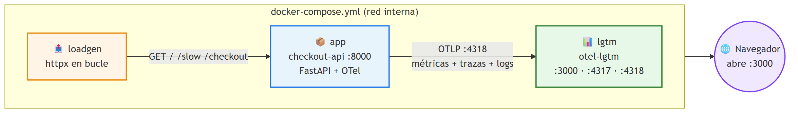
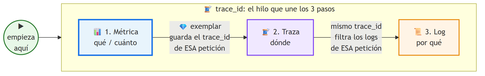
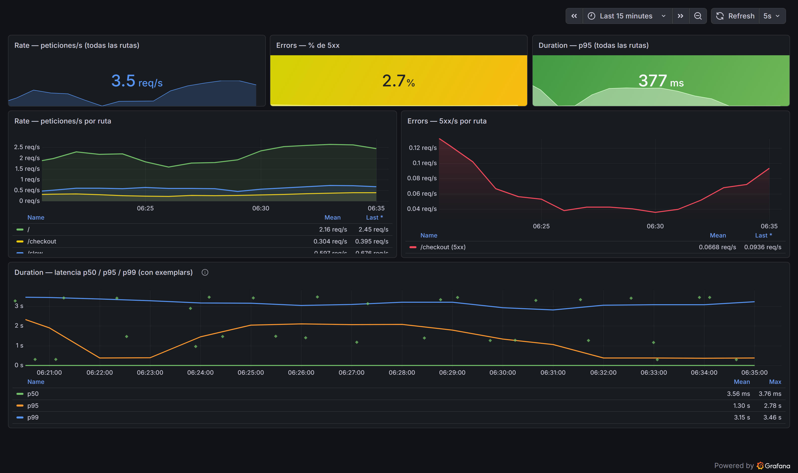
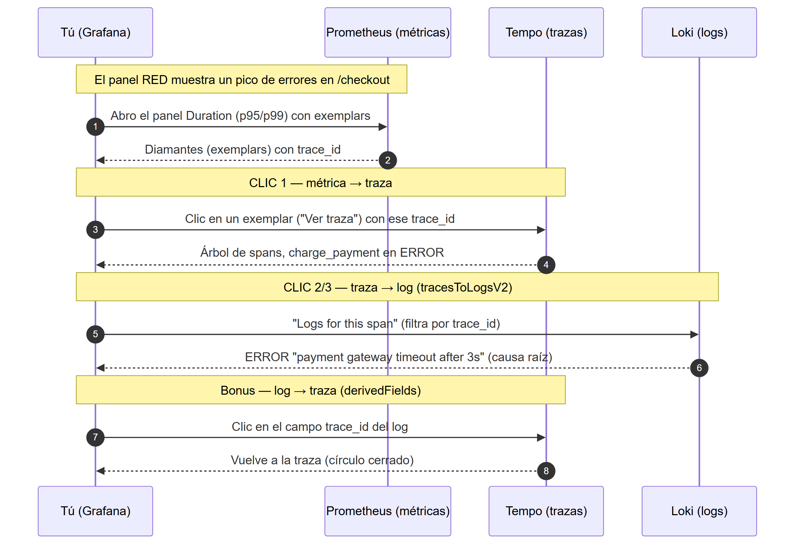
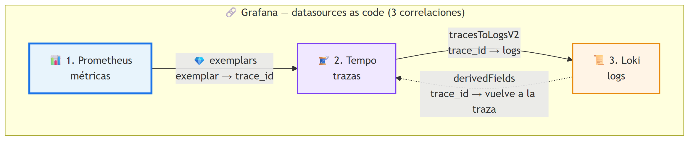
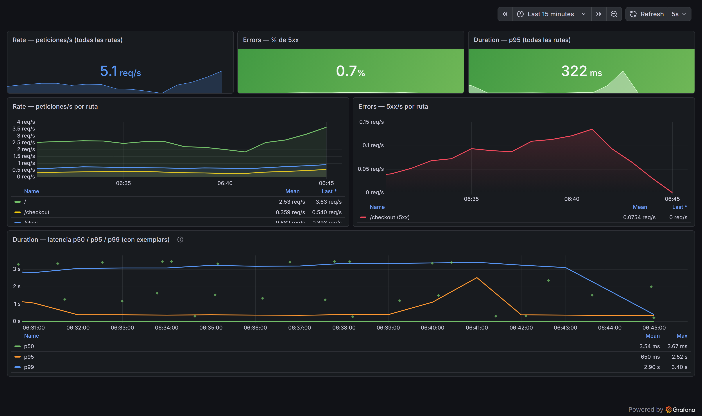
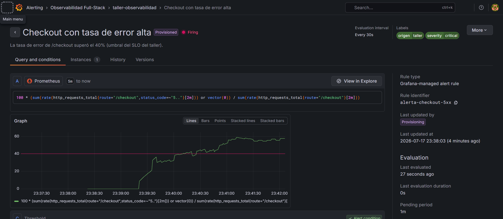
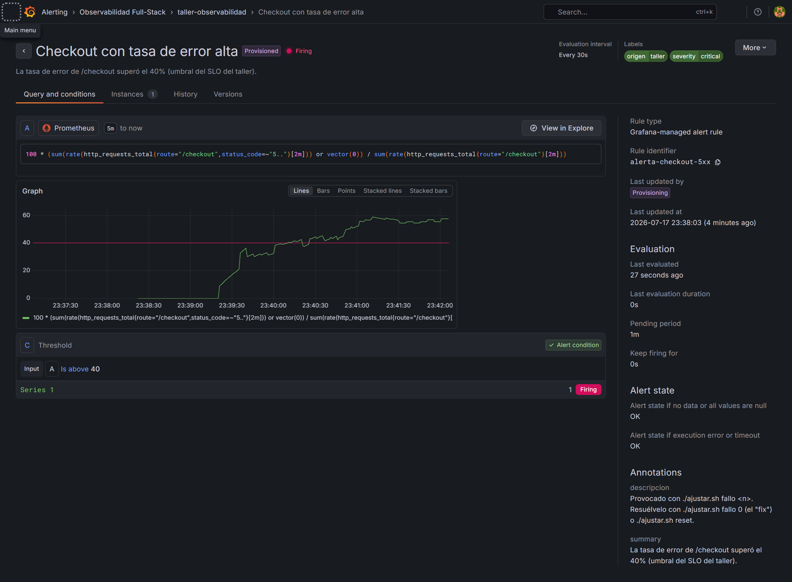

# Guía para participantes — Observabilidad Full-Stack con Grafana

**Workshop:** Observabilidad Full-Stack: De métricas crudas a Dashboards que toman decisiones con Grafana
**Ponente:** Julián Andrés Castaño
**Comunidad:** Cloud Native 2026
**Duración estimada:** 45–60 min
**Modalidad:** 100% en la nube (**GitHub Codespaces**), sin instalación local. Alternativas: Google Cloud Shell o Docker local. No requiere instalar Grafana/Prometheus a mano.

---

## Qué vas a construir

> 🎯 **Objetivo del taller:** aprender a pasar de **monitorear** (ver *que* algo falla) a **observar**
> (entender *por qué*, en segundos). Al terminar sabrás: **(1)** instrumentar una app con OpenTelemetry,
> **(2)** montar el stack LGTM con Docker Compose, **(3)** diseñar un dashboard **RED** que responda
> "¿roto? ¿para quién? ¿dónde? ¿actúo ya?", y **(4)** correlacionar los 3 pilares por `trace_id` para ir
> de una métrica → la traza → el log de la causa raíz, en 3 clics. *"Full-stack"* aquí = las tres señales
> juntas (métricas + trazas + logs), no frontend/backend.

### El formato del taller: construye → ajusta → míralo en el dashboard

Todo el taller se maneja con **6 scripts**. Construyes el sistema con uno, luego "giras perillas"
y provocas escenarios con otros, y **cada acción tiene un efecto visible en Grafana**. Nunca editas
YAML ni código en vivo: script → dashboard → entender.

| Script | Qué hace | Qué VES en el dashboard |
|---|---|---|
| `./start.sh` | **construye y levanta todo** (backend LGTM + app + tráfico) | los paneles RED empiezan a llenarse |
| `./trafico.sh pico\|lento\|mixto` | provoca **ráfagas** de tráfico/errores/latencia | picos en Errors / Duration |
| `./ajustar.sh fallo\|latencia <0-100>` | **gira las perillas del sistema en vivo** (tasa de fallo, latencia) | el dashboard cambia de nivel: incidente 📈 y recuperación 📉 |
| `./alerta.sh` | estado de la **alerta** provisionada + notificaciones recibidas | 🔔 Normal → Pending → FIRING → Resolved |
| `./estado.sh` | servicios, perillas activas y URLs | — |
| `./stop.sh` | detiene y **limpia todo** | — |

Lo que ese `./start.sh` construye:

1. **Backend de observabilidad (LGTM)** — el contenedor `grafana/otel-lgtm` trae **Grafana + Prometheus + Tempo + Loki + OpenTelemetry Collector** en uno solo. Recibe telemetría por OTLP.
2. **App instrumentada con OpenTelemetry** — una API en Python (**FastAPI**) que emite las **tres señales** (métricas, trazas, logs) por OTLP. Endpoints: `/` (rápido), `/slow` (latencia variable), `/checkout` (**falla ~20%**), `/healthz`. Las tasas de fallo/latencia son **perillas** ajustables con `./ajustar.sh`.
3. **Generador de carga** — golpea la API en bucle para llenar los dashboards y provocar errores/latencia.

Además, el provisioning ya trae configuradas las **correlaciones** que cosen los tres pilares por `trace_id`: **exemplars** (métrica→traza), **traza→log** y **log→traza**. Y un dashboard **RED** (Rate, Errors, Duration) como código.

> La frase para llevarte: pasamos de **métricas crudas** (200 paneles que nadie mira) a un **dashboard que decide** (¿está roto?, ¿para quién?, ¿dónde?, ¿debo actuar ya?).

**Los tres servicios que levanta el `docker-compose.yml`:**



**La idea de fondo — los 3 pilares cosidos por `trace_id`:** métricas te dicen *qué/cuánto*, trazas *dónde*, logs *por qué*; el `trace_id` es el hilo que te deja saltar de una a otra sin adivinar.



---

## Prerrequisitos

| Requisito | Detalle |
|---|---|
| **Cuenta de GitHub** | Lo único imprescindible. El taller corre en **GitHub Codespaces** desde el navegador |
| Navegador moderno | Chrome / Edge / Firefox actualizado |
| Conocimientos | Nivel intermedio: terminal y nociones de HTTP/contenedores |
| (Alternativa) Cuenta de Google | Para correrlo en **Google Cloud Shell** |
| (Alternativa) Docker local | **Docker Desktop** / **Docker Engine** + plugin `compose`, si prefieres tu máquina |

> **No necesitas instalar nada.** Con una cuenta de GitHub, cada participante lanza su propio
> entorno en la nube desde el navegador: Docker ya viene listo dentro del Codespace y cada quien
> tiene su entorno **aislado**, así que **todos lo pueden reproducir** a la vez, en clase y en casa.

> ⚠️ **Costos:** cero para el taller. GitHub Codespaces incluye un **free tier** (~60 h/mes en
> máquina de 2 núcleos + 15 GB-mes de almacenamiento). Aun así, al terminar **detén tu codespace**
> (Codespaces → … → Stop) y limpia con `./stop.sh` (= `docker compose down -v`) para no consumir horas.

> 🛡️ **Seguridad:** Grafana arranca con `admin/admin` solo para el taller. La API no tiene
> autenticación (es una demo). En Codespaces el puerto reenviado es **privado por defecto**: solo
> tú lo ves, salvo que subas su visibilidad.

---

## Paso 0 — Abre tu entorno en la nube (GitHub Codespaces)

### 0.1 Crea tu Codespace

1. Entra al **repo del taller**: <https://github.com/AndresDFX/observabilidad-fullstack-grafana>
2. Pulsa el botón verde **Code → pestaña Codespaces → Create codespace on main**
   (o usa el badge **"Open in GitHub Codespaces"** del README).
3. Espera 1–2 min mientras GitHub crea tu entorno: una VM Linux con **Docker ya listo**, definida por
   `.devcontainer/devcontainer.json`. Al terminar, tienes **VS Code en el navegador** con el repo abierto.

> 💡 Cada participante obtiene **su propio Codespace aislado**: nadie compite por recursos ni puertos.

📷 **Pantallazo sugerido:** el menú **Code → Codespaces → Create codespace on main**.

### 0.2 Verifica que Docker está disponible

En la **Terminal** del Codespace (menú Terminal → New Terminal):

```bash
docker version
docker compose version
```

Deberías ver versiones de cliente y servidor (Docker viene incluido por el devcontainer).

### 0.3 Conoce la estructura del repo

```bash
ls
```

```
.
├── .devcontainer/devcontainer.json  → define el Codespace (Docker-in-Docker, puertos 3000/8000)
├── docker-compose.yml               → los 3 servicios: lgtm, app, loadgen
├── start.sh                         → PASO 1: construye y levanta TODO
├── trafico.sh                       → provoca ráfagas (pico | lento | mixto)
├── ajustar.sh                       → gira las perillas en vivo (fallo | latencia | reset)
├── alerta.sh                        → estado de la alerta + notificaciones recibidas
├── estado.sh                        → servicios, perillas y URLs
├── stop.sh                          → detiene y limpia TODO
├── app/
│   ├── main.py                      → FastAPI + OpenTelemetry (traces + metrics + logs)
│   ├── requirements.txt
│   └── Dockerfile
├── loadgen/
│   ├── loadgen.py                   → generador de tráfico (httpx en bucle)
│   └── Dockerfile
└── grafana/
    ├── provisioning/
    │   ├── datasources/datasources.yml   → Prometheus/Tempo/Loki + correlaciones
    │   ├── dashboards/dashboards.yml
    │   └── alerting/alertas.yml          → la ALERTA como código (regla + webhook + política)
    └── dashboards/red-dashboard.json     → dashboard RED con exemplars
```

---

## Paso 1 — Construye TODO con un script (~2–3 min la primera vez)

En la **Terminal** del Codespace:

```bash
./start.sh
```

Por dentro esto:
1. Construye la imagen de `app` (FastAPI + OpenTelemetry) y de `loadgen` (httpx).
2. Descarga `grafana/otel-lgtm` (Grafana + Prometheus + Tempo + Loki + Collector).
3. Arranca los tres servicios en una red interna; `loadgen` espera a que `app` responda a `/healthz`.
4. Te imprime las **URLs** y el **mapa de scripts** del resto del taller.

La salida termina así — ese bloque es tu guía de navegación:

```
============================================================
  Stack de observabilidad ARRIBA ✅
============================================================
  Grafana ............ http://localhost:3000   (admin / admin)
  API (checkout) ..... http://localhost:8000/   ·  /slow  ·  /checkout  ·  /healthz

  EL RESTO DEL TALLER SON ESTOS SCRIPTS (en este orden):
    ./trafico.sh pico        -> provoca un pico de errores      (míralo aparecer en Errors)
    ./trafico.sh lento       -> provoca un pico de latencia     (míralo en el p95 de Duration)
    ./ajustar.sh fallo 50    -> INCIDENTE: 50% de checkouts caen (mira Errors dispararse)
    ./ajustar.sh fallo 0     -> "el fix": mira la recuperación en vivo 📉
    ./alerta.sh              -> ¿la ALERTA está Normal/Pending/FIRING? 🔔
    ...
```

Verifica el estado cuando quieras:

```bash
./estado.sh
```

Deberías ver los tres servicios `Up` (`lgtm` y `app` como `healthy`) y las perillas activas
(`CHECKOUT_FAILURE_RATE=20%  SLOW_SPIKE_RATE=5%`).

> ⏱️ En Codespaces, el `.devcontainer` ya corrió `docker compose pull && build` al crear el entorno
> (pre-descargó `otel-lgtm` ~1 GB y construyó las imágenes), así que este `start.sh` suele ser rápido.
> En Cloud Shell / local, la primera vez sí baja la imagen (~1 GB) según tu red.
> Si `./start.sh` da "Permission denied": `chmod +x *.sh` (o antepón `bash`, p. ej. `bash start.sh`).

---

## Paso 2 — Abrir Grafana (URL reenviada del Codespace)

1. En VS Code (Codespace), abre la pestaña **Ports** (barra inferior, junto a la Terminal).
2. Busca el puerto **3000** (etiquetado **Grafana**). Pasa el cursor y pulsa el icono del **globo 🌐**
   (*Open in Browser*), o copia la **URL reenviada** — tiene la forma
   `https://<tu-codespace>-3000.app.github.dev` (¡**no** `localhost`!).
3. Login en Grafana: usuario **`admin`**, contraseña **`admin`** (puedes saltar el cambio).
4. Menú **Dashboards → carpeta "Observabilidad Full-Stack" → "RED — checkout-api"**.

Dale ~30–60 s a que la telemetría llene los paneles (el `loadgen` ya genera tráfico y las métricas
se exportan cada 5 s).

Así se ve el dashboard **RED — checkout-api** con datos reales (esta captura es de una corrida del
propio taller):



> 💡 Si los paneles están vacíos al inicio, espera un poco y pulsa el refresco (auto-refresh 5 s).
> Si al abrir el 3000 ves un aviso de visibilidad, déjalo en **Private** (solo tú); súbelo a
> **Public** solo si quieres compartir tu Grafana. Si aparece un aviso de "Grafana Assistant",
> ciérralo (Escape).

### Anatomía del dashboard RED (qué mira cada panel)

| Panel | Qué mide | Cómo leerlo |
|---|---|---|
| **Rate — peticiones/s (stat, arriba izq.)** | peticiones/s totales | pulso de tráfico; si cae a 0, nadie te está llamando (¿caída total?) |
| **Errors — % de 5xx (stat, centro)** | % de respuestas 5xx | el semáforo: verde <1%, ámbar, rojo. Aquí ~2–3% por el 20% de fallos de `/checkout` sobre el total |
| **Duration — p95 (todas las rutas)** (stat, der.) | latencia p95 global | "el 95% de las peticiones responde en menos de esto" |
| **Rate por ruta (timeseries)** | req/s por endpoint | ves que `/` domina y `/checkout`/`/slow` son minoría |
| **Errors 5xx/s por ruta (timeseries)** | errores por endpoint | el **pico vive en `/checkout`** — el "¿para quién?" |
| **Duration — latencia p50 / p95 / p99 (con exemplars)** | latencia por percentil | el que salta con `/slow` es el **p95 (naranja)**; el **p99 (azul)** lo fijan los `/checkout` que fallan por timeout (~3 s). Los **diamantes** son *exemplars* → clic para saltar a la traza |

> 🔑 **Fíjate en los diamantes** del panel de Duration: cada uno es una petición real con su
> `trace_id`. Son la puerta de entrada al drill-down del Paso 4.

---

## Alternativas de entorno (si no usas Codespaces)

El stack y los scripts son los mismos; solo cambia **dónde** corre y **cómo** abres Grafana. En
las tres opciones usas `./start.sh` (y luego `./trafico.sh`, `./ajustar.sh`, `./stop.sh`).

### (a) Google Cloud Shell — solo necesitas una cuenta de Google

```bash
git clone https://github.com/AndresDFX/observabilidad-fullstack-grafana.git
cd observabilidad-fullstack-grafana
./start.sh
```

Abre Grafana con **Web Preview** (botón arriba a la derecha de Cloud Shell) → **Change port → 3000 →
Preview**. Cloud Shell te da una URL `https://3000-...cloudshell.dev`. Login `admin`/`admin`.

> Cloud Shell trae Docker y `docker compose` preinstalados. La sesión es efímera (se recicla tras
> inactividad), pero para el taller sobra.

### (b) Docker local — si ya tienes Docker en tu máquina

```bash
git clone https://github.com/AndresDFX/observabilidad-fullstack-grafana.git
cd observabilidad-fullstack-grafana
./start.sh
```

Abre <http://localhost:3000> (login `admin`/`admin`). Requiere **Docker Desktop** (Windows/Mac) o
**Docker Engine + plugin compose** (Linux), y los puertos **3000/8000/4317/4318** libres.

> En cualquiera de las tres opciones, la app habla con el backend por la **red interna de Compose**
> (`app → lgtm:4318`): eso no cambia. Lo único distinto es la URL con la que TÚ abres Grafana.

---

## Paso 3 — Provoca un pico con un script y míralo aparecer

El `loadgen` ya genera tráfico de fondo, pero ahora vas a provocar **tú** un pico y verlo aparecer
en el dashboard. Deja Grafana visible a un lado y lanza en la terminal:

```bash
./trafico.sh pico
```

El script dispara una ráfaga de checkouts, te cuenta cuántos fallaron, y te dice **exactamente qué
paneles mirar**:

```
════════════════════════════════════════════════════════════
 ESCENARIO: PICO DE ERRORES — ráfaga de checkouts
════════════════════════════════════════════════════════════
   /checkout  -> 60 peticiones · 52 ok ·  8 con error

 👀 QUÉ MIRAR EN EL DASHBOARD (dale ~30 s):
    · "Errors — % de 5xx"        -> el número sube
    · "Errors — 5xx/s por ruta"  -> pico rojo en /checkout
    · "Duration (con exemplars)" -> nuevos diamantes = peticiones reales para el drill-down
```

Ahora el de latencia:

```bash
./trafico.sh lento     # pico forzado en /slow -> mira el p95 dispararse en Duration
```

| Escenario | Qué provoca | Qué verás en el dashboard |
|---|---|---|
| `./trafico.sh pico` | ráfaga de checkouts (~20% fallan con 503) | pico rojo en **Errors**, sube el % de 5xx |
| `./trafico.sh lento` | 30 peticiones a `/slow` con **pico forzado** | el **p95** (naranja) salta de ~0.4 s a ~2 s, siempre. El **p99 no se mueve** — `/slow` tarda 2.5 s como máximo y el p99 lo fijan los timeouts de `/checkout` (2.8–3.5 s) |
| `./trafico.sh mixto` | de todo un poco | suben las tres rutas en Rate |

> 🔁 **La mecánica del taller es esta:** script en la terminal → 30 s → efecto en el dashboard.
> Repite los escenarios cuantas veces quieras; cada ráfaga deja nuevos diamantes (exemplars)
> para el siguiente paso.

Si quieres ver el tráfico de fondo en vivo: `docker compose logs -f loadgen` (Ctrl+C para salir).

📷 **Pantallazo sugerido:** el panel **Errors — 5xx/s por ruta** con el pico en `/checkout`.

---

## Paso 4 — El momento "wow": del síntoma a la causa raíz en 3 clics

Este es el corazón del taller. Vamos a partir de un pico en una métrica y llegar a la línea de log exacta que explica la causa, **sin cambiar de herramienta**.

Este es el recorrido que vas a hacer (los 3 clics + el bonus de vuelta):



Y estas son las **tres correlaciones** que lo hacen posible (configuradas como código en los datasources):



**Clic 1 — de la métrica a la traza (exemplar):**
1. En el dashboard, mira el panel **Duration — latencia p50 / p95 / p99 (con exemplars)**.
2. Verás **diamantes** repartidos por el panel: son *exemplars*. Ojo, **no van sobre las líneas**: cada diamante se dibuja a la latencia REAL de UNA petición concreta. La línea es la estadística; el diamante es un caso real.
3. Pasa el cursor sobre un diamante en la zona **más alta** (arriba de ~2.5 s) → tooltip con su `trace_id` y un botón **"Ver traza"**. Clic → se abre **Tempo**.

> 🔑 **Por qué los diamantes más altos son los que te interesan:** un checkout que falla lo hace por
> un **timeout de la pasarela (~3 s)** — o sea, los fallos son también las peticiones **más lentas**.
> Por eso el diamante más alto casi siempre cae en un `/checkout` en ERROR. (Los diamantes ~1–2.5 s
> son de `/slow`: latencia sin error; útiles para la historia de "dónde tarda", no para esta.)

**Clic 2 — la traza (el "dónde"):**
4. Se abre el árbol de **spans** de esa petición en **Tempo**. La estructura de un checkout fallido es:
   ```
   GET /checkout                 (span raíz, del servidor)
   ├─ validate_cart              ~20–80 ms
   └─ charge_payment             ~3 s → ROJO (ERROR)   ← el timeout de la pasarela
   ```
   El span **`charge_payment`** está **rojo (ERROR)**, con `payment.outcome=declined` y un evento de
   excepción `payment gateway timeout`. Arriba verás el `Trace ID`: es el mismo hilo que traías desde
   el exemplar. (Si abriste una traza de `/slow` por error —solo `query_inventory`, sin ERROR—, vuelve
   y elige un diamante más alto, o usa el atajo fiable de abajo.)

**Clic 3 — el log (el "por qué"):**
5. En la vista de la traza, pulsa **"Logs for this span"** (habilitado por `tracesToLogsV2`, ver diagrama). Grafana consulta **Loki** filtrando por el `trace_id`.
6. Aparece la línea exacta, con el mismo `trace_id`:
   ```
   ERROR [trace_id=e7073683316a...] checkout failed: payment gateway timeout after 3s (order_id=ord-48213)
   ```
   Esa es la **causa raíz**: no un "algo falla", sino *qué* falló, *en qué petición* y *por qué*.

**Bonus — del log de vuelta a la traza:**
7. En ese log de Loki, el campo `trace_id` es un **enlace** (derived field): clic → te devuelve a la traza en Tempo. El círculo se cierra.

> ⏱️ **Todo el recorrido son ~10 segundos y 3 clics.** Antes, ese mismo diagnóstico eran varias
> herramientas, copiar-pegar timestamps y adivinar. Ese es el salto del taller.

> 💡 **Atajo fiable al error (si no ves exemplars, o para ir directo a un fallo):** **Explore** (menú lateral) → datasource **Tempo** → pestaña **Search** → filtra `Service Name = checkout-api` y `Status = error` → abre una traza → sigue desde el **Clic 2**. Llegas al mismo sitio; solo cambia el primer salto. En vivo es la vía más segura para caer siempre en un checkout fallido.

📷 **Para tu propia doc:** encadena tus tres capturas — el diamante en el panel Duration → la traza con `charge_payment` en rojo → el log de ERROR en Loki. (El dashboard de partida es el del Paso 2.)

---

## Paso 5 — Gira las perillas: provoca un incidente y despliega "el fix"

Hasta ahora provocaste **ráfagas** (picos puntuales). Ahora vas a cambiar el **comportamiento del
sistema** en vivo y ver el dashboard cambiar de nivel — como en un incidente real y su resolución.
Todo con `./ajustar.sh`, sin tocar código ni YAML.

**1. Provoca el incidente** — sube la tasa de fallo del checkout al 50%:

```bash
./ajustar.sh fallo 50
```

El script escribe la perilla en `.env`, recrea **solo** el contenedor de la app (~2 s) y te dice qué
mirar. En el dashboard (30–60 s): el stat **"Errors — % de 5xx"** trepa y la línea de `/checkout` en
**"Errors — 5xx/s por ruta"** salta a un nuevo nivel. Estás viendo un incidente **empezar**.

**2. Investiga como en el Paso 4** — nuevos diamantes, mismas 3 correlaciones: exemplar → traza →
log. La causa raíz sigue siendo el `payment gateway timeout`, ahora mucho más frecuente.

**3. Despliega "el fix"** — baja la tasa de fallo a cero:

```bash
./ajustar.sh fallo 0
```

Mira el dashboard: la curva de errores **cae en picada** 📉. Eso que estás viendo es exactamente lo
que verías en producción al desplegar un arreglo: la **recuperación en vivo**, y el momento en que
dejarías de quemar error budget.

Así se ve el ciclo completo en el panel de errores (captura real de este taller — el escalón de
subida es el incidente; la caída, el fix):



**4. Vuelve a los valores del taller:**

```bash
./ajustar.sh reset      # fallo 20%, latencia 5%
```

> 🎛️ **La otra perilla:** `./ajustar.sh latencia 60` hace que el 60% de las peticiones a `/slow`
> tengan picos de 1–2.5 s → mira el **p95** cambiar de nivel en Duration (el p99 no: ese lo fija
> la perilla `fallo`, no esta). Y `./ajustar.sh estado`
> te muestra las perillas activas en cualquier momento.

> 💡 **Por qué esto importa:** la mitad de la observabilidad es *entender qué cambió*. Aquí el
> cambio lo haces tú con un script y ves el efecto con tus propios ojos: causa → efecto → dashboard.
> En producción, ese "ajuste" es un deploy, un feature flag o una config — y el dashboard reacciona
> igual.

---

## Paso 6 — Alertamiento: que el sistema te busque a ti

Hasta aquí **tú** miras el dashboard. En producción, a las 3am, nadie lo mira: la **alerta** invierte
la dirección. El taller trae una regla provisionada **como código**
(`grafana/provisioning/alerting/alertas.yml`), con un criterio de impacto al usuario:

> **"Si más del 40% de los checkouts falla durante 1 minuto → FIRING"**

Y la notificación llega por **webhook a la propia app** (`POST /alerta`), que la loguea → el log
viaja a **Loki** → *la alerta misma queda observable en el mismo stack*. Todo local, sin correo ni
Slack (en producción solo cambiarías el contact point).

**1. Mira el estado inicial de la regla:**

```bash
./alerta.sh
```

```
==> Estado de la regla:
   Checkout con tasa de error alta: 🟢 Normal
```

**2. Provoca el incidente** (supera el umbral del 40%):

```bash
./ajustar.sh fallo 60
```

**3. Observa el ciclo de vida** — corre `./alerta.sh` cada ~30 s (o mira **Grafana → Alerting →
Alert rules**): verás `🟢 Normal → 🟡 Pending → 🔴 FIRING` en ~1–2 min. No es lentitud: el `for: 1m`
de la regla es **anti-ruido** (no te despierta por un blip de 10 segundos).

Así se ve la regla disparada (captura real del taller — nota el badge **Firing** y cómo la consulta **cruza el umbral de 40**):



### Anatomía del tablero de alertas (qué significa cada cosa)

| Elemento | Qué es | En el taller |
|---|---|---|
| **State** | el semáforo de la regla | `Normal` (verde) → `Pending` (amarillo: condición cumplida, esperando el `for`) → `Firing` (rojo: notificando) |
| **Query (A)** | la consulta que se evalúa | PromQL: % de 5xx de `/checkout` en los últimos 2 min |
| **Condition (C)** | el umbral | `> 40` (por eso `fallo 20` no dispara y `fallo 50+` sí) |
| **For** | cuánto debe sostenerse | `1m` — el filtro **anti-ruido**: un blip de 10 s no despierta a nadie |
| **Labels** | metadatos para enrutar | `severity=critical`, `origen=taller` → la política decide a qué contact point va |
| **Contact point** | a dónde notifica | `taller-webhook` → `POST http://app:8000/alerta` (en prod: Slack/PagerDuty) |

Y el **detalle de la regla** (clic en su nombre) muestra la consulta, el umbral y el historial de
estados — útil para explicar *por qué* disparó:



**4. Mira llegar la notificación** (el webhook quedó guardado en **Loki**, la memoria durable):

```bash
./alerta.sh
```

```
... WARNING [trace_id=0] 🔔 ALERTA FIRING: Checkout con tasa de error alta — La tasa de error de /checkout superó el 40% ...
```

Es lo mismo que verías en **Loki** (Explore): `{service_name="checkout-api"} |= "ALERTA"` — la
notificación es un log más, y por eso sobrevive aunque el contenedor de la app se recree. 🤯

**5. Despliega "el fix" y mira resolverse sola:**

```bash
./ajustar.sh fallo 0      # en ~1 min: ✅ Resolved (y llega el webhook de resolución)
./ajustar.sh reset        # vuelve a los valores del taller
```

> 💡 **El criterio importa más que la tecnología:** la regla NO dice "CPU > 90%"; dice "los usuarios
> no pueden pagar". Esa es la única clase de alerta por la que vale la pena despertarse — y conecta
> con el SLO/error budget de la charla.

📷 **Pantallazo sugerido:** Grafana → Alerting → Alert rules con la regla en **rojo (FIRING)** junto a la terminal con el log `🔔 ALERTA FIRING`.

---

## Paso 7 — Explorar las tres señales por separado (Explore)

Para afianzar, usa **Explore** (menú lateral) con cada datasource:

**Métricas (Prometheus)** — PromQL:
```promql
# Rate por ruta
sum by (route) (rate(http_requests_total[$__rate_interval]))

# Error % 
100 * sum(rate(http_requests_total{status_code=~"5.."}[$__rate_interval]))
    / sum(rate(http_requests_total[$__rate_interval]))

# Latencia p95
histogram_quantile(0.95, sum by (le) (rate(http_request_duration_seconds_bucket[$__rate_interval])))
```

**Logs (Loki)** — LogQL:
```logql
{service_name="checkout-api"}                      # todos los logs del servicio
{service_name="checkout-api"} |= "ERROR"           # solo errores
```

**Trazas (Tempo)** — Search:
```
Service Name = checkout-api ; Status = error       # trazas fallidas
```

📷 **Pantallazo sugerido:** Explore con las tres pestañas (métrica, log, traza) del mismo servicio.

---

## Paso 8 — Limpiar todo (¡importante!)

Como todo lo demás, con un script:

```bash
./stop.sh
```

(equivale a `docker compose down -v`)

Esto elimina:
- Los tres contenedores (`lgtm`, `app`, `loadgen`).
- La red interna que creó Compose.
- Los **volúmenes** con toda la telemetría (`-v`).

> ⚠️ **No olvides el `-v`.** Sin él quedan volúmenes ocupando disco. Con él, tu entorno queda como estaba. Las imágenes construidas siguen en caché (bórralas con `docker image prune` si quieres espacio).

> ☁️ **En Codespaces:** además, **detén o borra tu codespace** al terminar para no gastar horas del free tier — en <https://github.com/codespaces> (o la pestaña **Codespaces** de VS Code) → **⋯ → Stop / Delete**. Un codespace **detenido** no consume horas de cómputo.

📷 **Pantallazo sugerido:** la terminal tras `down -v` confirmando contenedores/red/volúmenes eliminados.

---

## Trabajo futuro: llévate la práctica a casa 🚀

El taller te deja la base; estos son los **siguientes pasos naturales**, en orden de dificultad
(cada uno es un buen ejercicio de "dashboards y alertas como código"):

1. **Panel de SLO/error budget** — añade al dashboard un panel que compare tu tasa de éxito contra
   un objetivo (p. ej. 99.5%) y muestre cuánto presupuesto de error llevas quemado. Es la 4ª
   pregunta ("¿actúo ya?") hecha panel.
2. **Alerta por burn-rate (la evolución del umbral fijo)** — la regla del taller usa `> 40%`
   (didáctico); en producción se alerta por **velocidad de quema del error budget** en dos ventanas
   (p. ej. 5m y 1h). Busca "multiwindow burn rate alerts" en la doc de Google SRE / Grafana.
3. **Contact point real** — cambia el webhook del taller por **Slack o Telegram** en
   `grafana/provisioning/alerting/alertas.yml` (solo el bloque `contactPoints`; la regla no se toca).
4. **Silences y mute timings** — programa ventanas de silencio (deploys, mantenimientos) para que
   la alerta no moleste cuando el ruido es esperado (Alerting → Silences).
5. **Instrumenta TU app** — OpenTelemetry tiene SDKs para casi todo lenguaje; replica el patrón:
   3 señales por OTLP + `trace_id` en los logs + exemplars en el histograma.
6. **Producción real** — Loki/Tempo/Mimir en modo distribuido, tail-sampling de trazas y retención
   por señal (ver FAQ "¿otel-lgtm sirve para producción?").

> 🎓 El mejor ejercicio: cuando tengas tu primer **drill-down métrica → traza → log en TU app**,
> compártelo con el ponente. Ese es el objetivo del taller cumplido.

---

## Diagnóstico rápido si algo falla

| Síntoma | Probable causa | Cómo verificar / arreglar |
|---|---|---|
| (local) `docker compose up` falla con "port is already allocated" | El 3000 u 8000 ya están en uso en tu máquina | Cierra lo que los use o cambia el mapeo de puertos en `docker-compose.yml` (no aplica en Codespaces) |
| Grafana no abre | `lgtm` aún inicializando (Grafana v13 tarda ~1 min), o (Codespaces) puerto no reenviado | `docker compose ps` (espera a `healthy`); en Codespaces abre la pestaña **Ports** y usa la URL reenviada del 3000 (no `localhost`) |
| Grafana queda `unhealthy` y **sin datasources ni dashboard** (Docker local Windows/macOS) | El repo está en una carpeta que Docker Desktop **no comparte** (p. ej. Google Drive `G:\`, unidades de red): el montaje del provisioning crea **carpetas vacías** y Grafana no lo carga | Mueve el repo a una carpeta compartida (tu perfil de usuario `C:\Users\...`) o añádela en **Docker Desktop → Settings → Resources → File Sharing**, y `docker compose up -d` de nuevo. **No aplica en Codespaces/Cloud Shell** (ahí siempre funciona) |
| (Codespaces) el navegador redirige al login de GitHub / da error al abrir el 3000 | Visibilidad del puerto | En **Ports**, clic derecho sobre el 3000 → **Port Visibility** (Private para ti; Public si compartes) |
| El dashboard no aparece / Explore no ve los datasources | Provisioning no montado | `docker compose logs lgtm \| grep -i provisioning`; verifica que `grafana/provisioning/**` se montó como **archivos** (no carpetas vacías): `docker exec obs-lgtm ls -l /otel-lgtm/grafana/conf/provisioning/datasources` |
| Paneles vacíos | Aún no llegan métricas | Espera 30–60 s; genera tráfico (Paso 3); en Explore→Prometheus busca `http_requests_total` |
| No hay exemplars (diamantes) | Pocos datos o exemplar-storage | Usa el Plan B: Explore→Tempo→Search (ver Paso 4) |
| La traza no muestra logs | `tracesToLogsV2` o ventana de tiempo | Amplía el rango; en Explore→Loki: `{service_name="checkout-api"} \|= "ERROR"` |
| La app no responde en :8000 | Contenedor `app` caído | `docker compose logs app`; `docker compose up -d --build app` |
| La alerta no pasa a FIRING | Umbral no superado o poco tiempo | `./ajustar.sh estado` (¿fallo ≥ 50?); espera 1–2 min (evalúa cada 30 s + `for: 1m`); revisa Grafana → Alerting |
| No llega la notificación del webhook | La app no está sana o la política no cargó | `docker compose logs app \| grep ALERTA`; `curl -s -u admin:admin localhost:3000/api/v1/provisioning/contact-points` |
| `loadgen` no genera tráfico | La app tardó en estar sana | `docker compose logs loadgen`; reinícialo: `docker compose restart loadgen` |
| Nombre de métrica distinto al del dashboard | Normalización OTLP→Prometheus | En Explore→Prometheus, Metrics browser, busca `http_request` y ajusta la query |

### Logs útiles

```bash
docker compose ps                      # estado de los 3 servicios
docker compose logs --tail=80 app      # ¿la app exporta telemetría?
docker compose logs --tail=80 lgtm     # ¿Grafana provisionó datasources/dashboards?
docker compose logs -f loadgen         # tráfico en vivo
curl -s localhost:8000/checkout ; echo # provoca (a veces) un 503
```

---

## Glosario rápido

- **Observabilidad:** capacidad de entender el estado interno de un sistema desde sus salidas (métricas, logs, trazas). No es "tener dashboards"; es poder responder preguntas nuevas sin desplegar código.
- **OpenTelemetry (OTel):** estándar abierto (CNCF) para instrumentar y exportar telemetría. **OTLP** es su protocolo.
- **OTLP:** el protocolo de OTel para enviar las 3 señales. Puertos típicos: 4317 (gRPC), 4318 (HTTP).
- **Los 3 pilares:** **métricas** (qué/cuánto), **trazas** (dónde), **logs** (por qué).
- **Span:** un tramo de una traza (una operación con inicio, fin y atributos). Una traza es un árbol de spans.
- **`trace_id`:** identificador único de una petición; aparece en las 3 señales y es el hilo que las correlaciona.
- **Exemplar:** una muestra concreta adjunta a una métrica que apunta a la traza que la originó (métrica→traza).
- **Derived field (Loki):** regla que convierte un campo del log (aquí `trace_id`) en un enlace a la traza.
- **RED:** **R**ate, **E**rrors, **D**uration. Método para medir la salud de un **servicio** (vista del usuario).
- **USE:** **U**tilization, **S**aturation, **E**rrors. Método para medir un **recurso** (CPU, disco, cola).
- **SLO:** objetivo de nivel de servicio (p. ej. 99.5% de peticiones < 1s).
- **Error budget:** margen de fallo que permite el SLO (`1 - SLO`); mide cuándo un problema es urgente.
- **Cardinalidad:** número de combinaciones distintas de labels de una métrica. Alta cardinalidad (ej. `user_id`) = muchas series = mucho costo.
- **LGTM:** **L**oki (logs) · **G**rafana (visualización) · **T**empo (trazas) · **M**imir/Prometheus (métricas).
- **PromQL / LogQL:** lenguajes de consulta de Prometheus (métricas) y Loki (logs).
- **GitHub Codespaces:** entorno de desarrollo en la nube (una VM Linux con VS Code en el navegador) definido por `.devcontainer/devcontainer.json`. Aquí trae Docker listo para correr el stack.
- **devcontainer:** archivo (`.devcontainer/devcontainer.json`) que describe el entorno del Codespace: imagen base, features (Docker-in-Docker), puertos reenviados y comandos de arranque.
- **Puerto reenviado (port forwarding):** en Codespaces/Cloud Shell, un puerto interno (3000) se expone en una URL pública temporal para abrirlo desde tu navegador.

---

## Recursos

- Repositorio: <https://github.com/AndresDFX/observabilidad-fullstack-grafana>
- Slides: archivo `Diapositivas.md` · FAQ: `FAQ.md`
- Documentación oficial:
  - GitHub Codespaces — <https://docs.github.com/en/codespaces>
  - Google Cloud Shell — <https://cloud.google.com/shell/docs>
  - OpenTelemetry — <https://opentelemetry.io/docs/>
  - Grafana `otel-lgtm` — <https://github.com/grafana/docker-otel-lgtm>
  - Grafana (exemplars, trace-to-logs) — <https://grafana.com/docs/grafana/latest/>
  - Prometheus / PromQL — <https://prometheus.io/docs/prometheus/latest/querying/basics/>
  - Loki / LogQL — <https://grafana.com/docs/loki/latest/query/>
  - Tempo — <https://grafana.com/docs/tempo/latest/>
